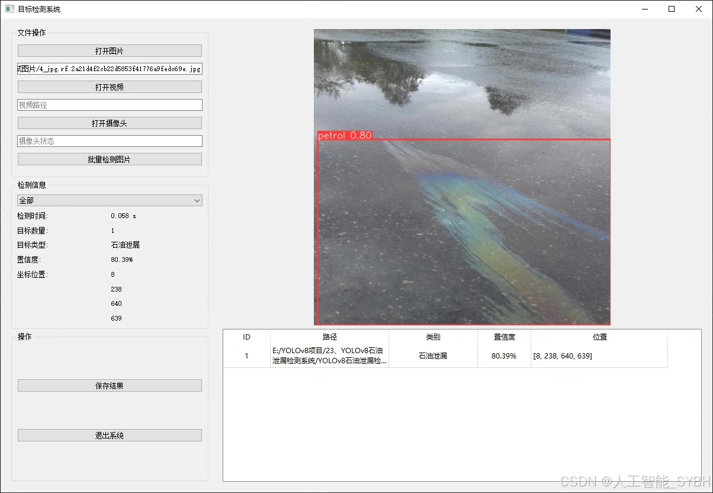
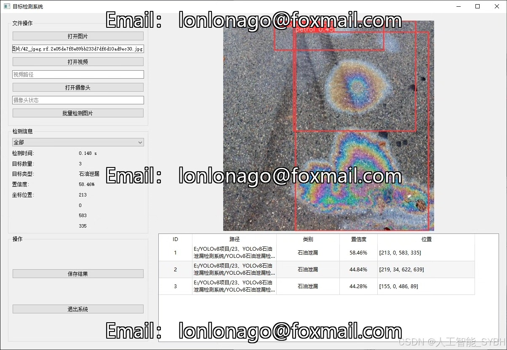
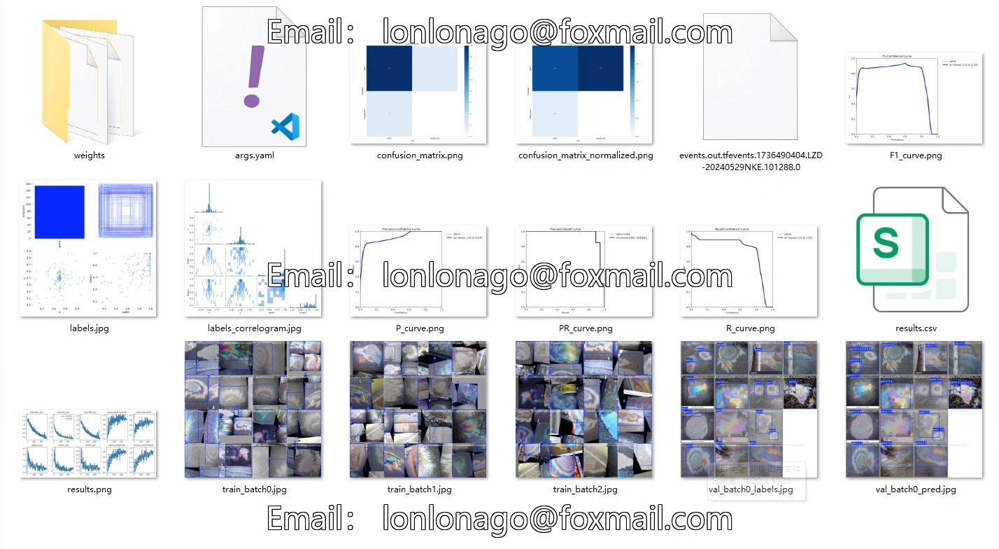
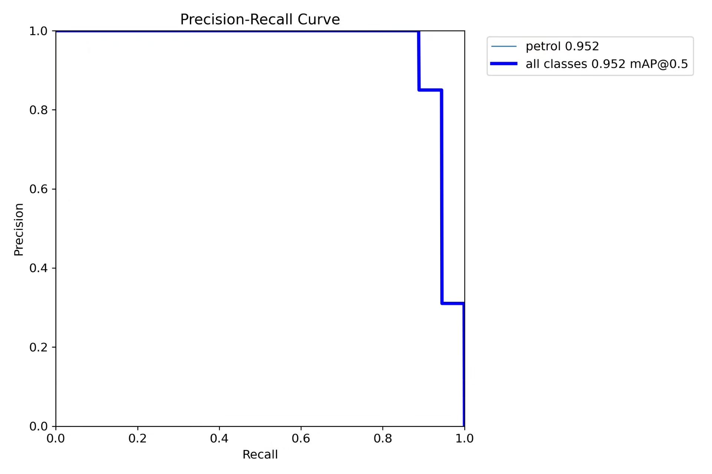
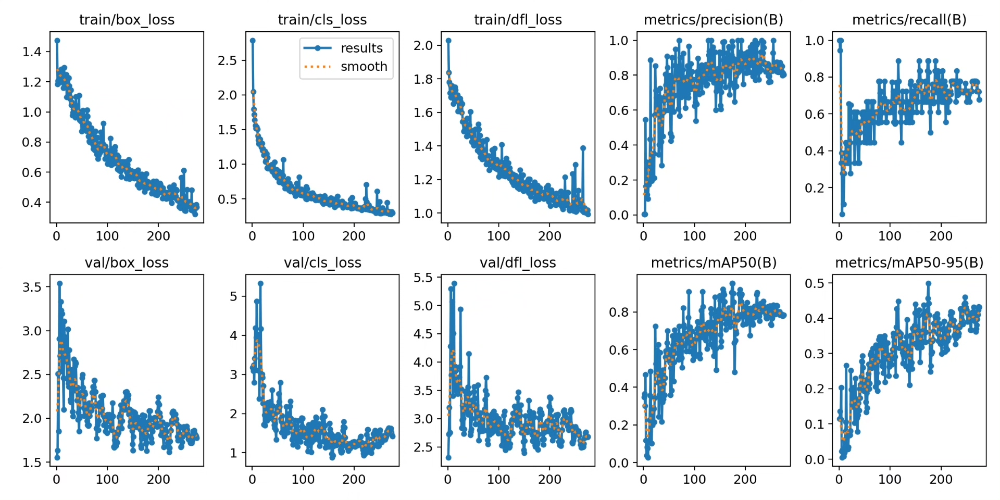
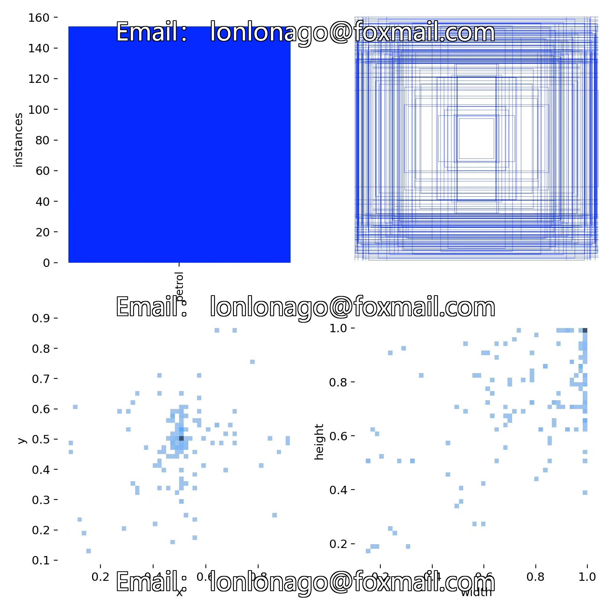
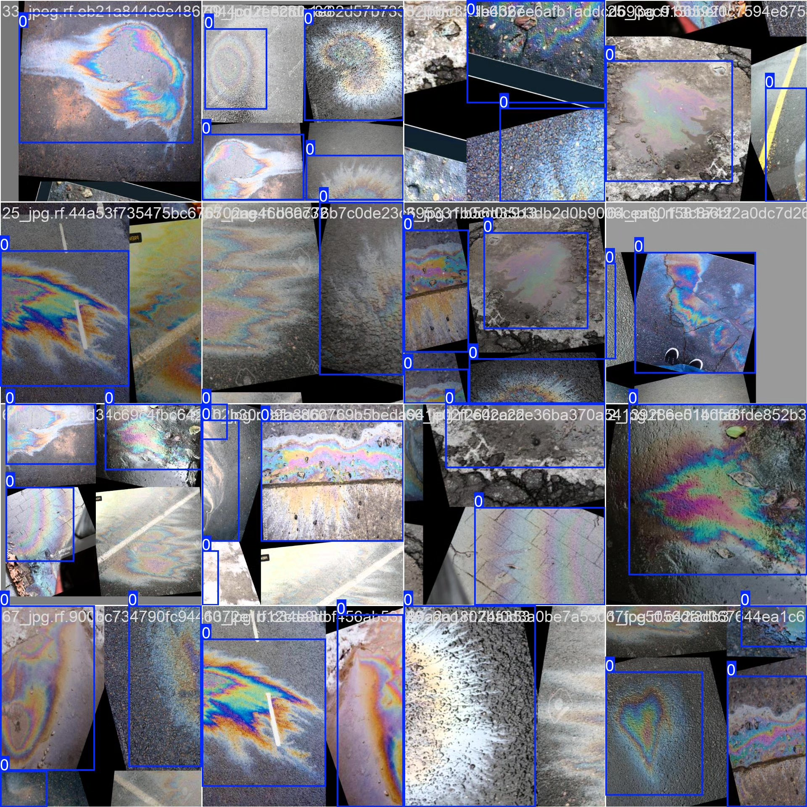
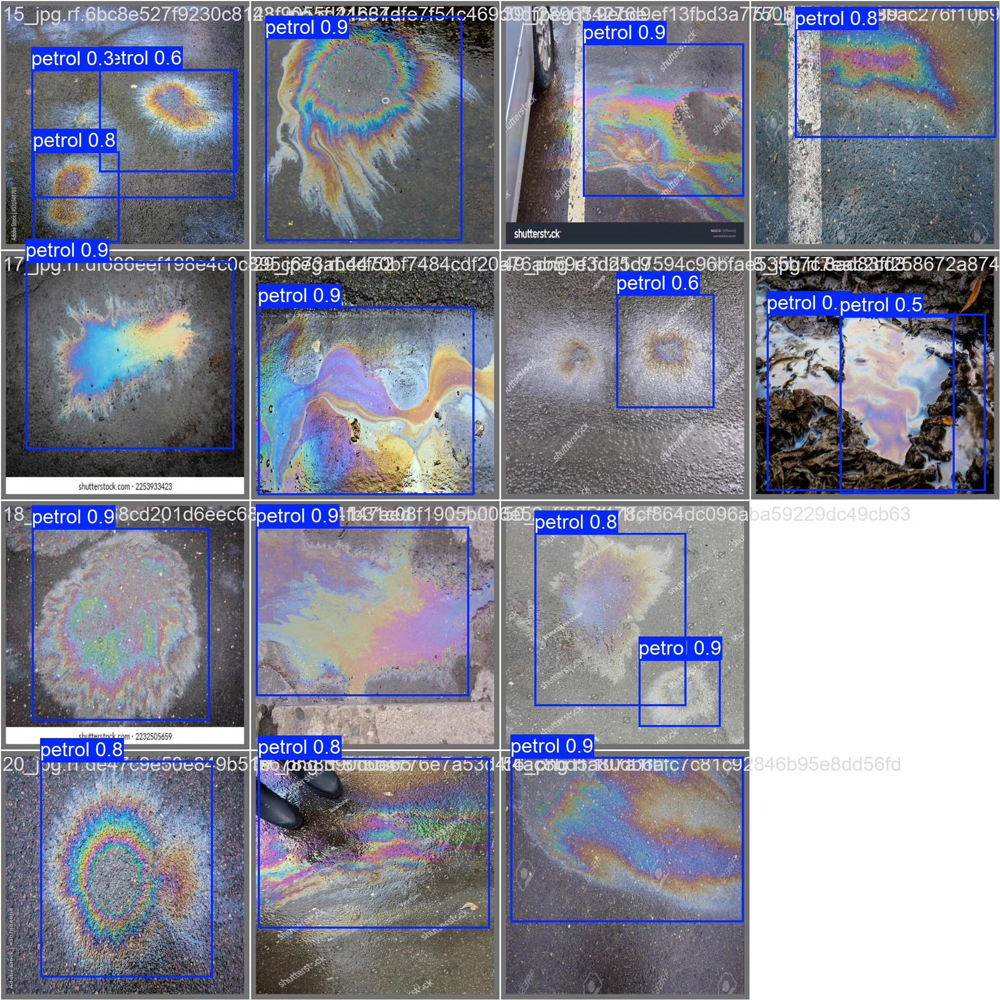

# Based on YOLOv8 deep learning for oil leak detection system (YOLOv8+Y)

## Body

Based on the YOLOv8 deep learning algorithm, we have developed a highly efficient and precise oil spill detection system. This system is specifically designed to identify and locate petroleum leakage areas in images or videos (category: petrol). The system was trained on a dataset of 130 training images and 24 validation images, and optimized its performance through techniques such as data augmentation and transfer learning. It can accurately detect oil pollution in complex environments, such as the ocean and industrial zones on land. The real-time detection capability of YOLOv8 makes it suitable for various scenarios, including drone inspection, satellite remote sensing monitoring, and industrial security surveillance, providing intelligent solutions for environmental monitoring and disaster early warning.

Our company's products have been granted commercial license certification by YOLO.
We provide after-sales service.
After payment, we will provide WeChat ID for any questions.
Environmental configuration: We will provide an instruction manual for setting up the environment, and WeChat will provide answers to questions.
Remote installation service: If you need remote configuration, an additional fee of 69 is required, with all fees refunded if the configuration fails (only the installation fee is refunded for older computers).
Retraining the dataset: Once the environment is set up, you can train on your own computer. If you need us to retrain, just pay 69 plus the computing power fee (2.5 yuan/hour).
Full after-sales service

## Images

## Payment

Here is a pay link on Stripe ( https://buy.stripe.com/3cs8yP7sY87d0vu9AB ). Please contact me lonlonago@foxmail.com after funding $89, and I will send you a complete data files , thank you!

